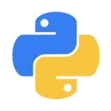
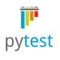

Python Learning
=
This repo has my learning on Python which encompasses following topics, essential for building an test framework.

```python
pip install -r requirements.txt
```

Concepts
-
OOP's, File Handling - Context Managers, Exception Handling, Collections, Programs & Tips & Tricks.




PyTest Framework
-
Path - `./Pytest`

PyTest `commands` to execute tests :-

1.To run all tests with verbose and console output
```python
py.test -v -s
```
2.To run tests of particular python file
```python
py.test filename.py -v -s
```
3.To run test for particular methods using its name
```python
py.test -k methodname -v -s
```
4.To run test for marked methods using given name (Ex:- Smoke, Regression)
```python
py.test -m givename -v -s
```
5.Generating report 
```python
pytest --html=report.html
```
>If any error then execute:- 
> ```python
> pip3 install pytest-html
> ```
> 


Pandas
-